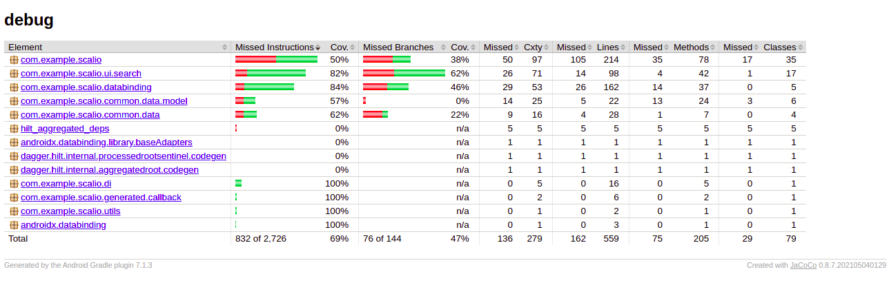

# Scalio Android Assesment Test

## Code Organization
This repository uses the Android JetPack library following the recommended MVVM architecture. Using Dagger/Hilt as dependency inject and Jacoco for coverage tool. The app using the Jetpack `Paging3` library for pagination and `Retrofit` for network requests.
Unit and Integration tests are written using `JUnit`, `Mockito`, `Espresso` and the `Jetpack Test framework`.

### Packaging
Activities and viewmodels are packaged based on each feature under the main `ui` package.
Apis are under the `api` package,
Shared code like repositories and everything else is under `commons`
Utilities are in `utils` package
Dagger/Hilt modules, components go under `di`

## Tests and Coverage
- UI tests are written using Espresso under the `androidTest` package
- Unit tests are availale under `test` package.
The total coverage is 69%, following is the coverage overview.
